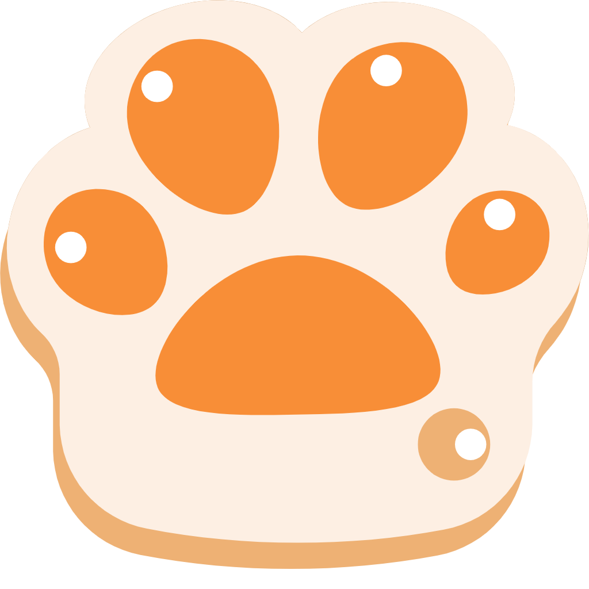

# 基于Pytorch的手写数字识别系统

<!-- PROJECT SHIELDS -->
[![Contributors][contributors-shield]][contributors-url]
[![Forks][forks-shield]][forks-url]
[![Stargazers][stars-shield]][stars-url]
[![MIT License][license-shield]][license-url]
<!-- PROJECT LOGO -->
<br />

<p align="center">
  <a href="https://github.com/wmh1024/CatDogRecognition">
    
  </a>

<h3 align="center">基于Pytorch的猫狗识别</h3>
  <p align="center">
    实现了对于自制数据集的猫狗图片识别。
    <br />
    对CUDA和MPS做了对应优化，提高了识别准确度和速度。
    <br />
</p>

## 上手指南

克隆此项目

```sh
git clone https://github.com/wmh1024/CatDogRecognition.git
```

运行程序

```sh
python main.py
```

## 使用到的框架

- pytorch
- matplotlib
- numpy

## 训练结果

测试设备：MacBook Air 2020 M1 8G内存 使用MPS优化

### 对于自制数据集

|  准确率   |  训练时间  | epoch |
|:------:|:------:|:-----:|
| 68.50% | 67.92s |  10   |

> 测试结果仅供参考，具体结果请自行测试。

## 开发者

- [wmh](https://github.com/wmh1024)
- [B1ld](https://github.com/z1922569567)
- [伊伊得一](https://gitee.com/yide-yi)
- [好想吃烤鱼饭](https://gitee.com/yan-mengjie1)

*您也可以在贡献者名单中参看其他参与该项目的开发者。*

## 联系我

wmh's wiki : https://wmhwiki.cn

## 如何参与开源项目

贡献使开源社区成为一个学习、激励和创造的绝佳场所。你所作的任何贡献都是**非常感谢**的。

1. Fork the Project
2. Create your Feature Branch (`git checkout -b feature/AmazingFeature`)
3. Commit your Changes (`git commit -m 'Add some AmazingFeature'`)
4. Push to the Branch (`git push origin feature/AmazingFeature`)
5. Open a Pull Request

## 版本控制

该项目使用 Git 进行版本管理。您可以在`repository`参看当前可用版本。

## 版权说明

该项目签署了MIT授权许可，详情请参阅 [LICENSE.txt](https://github.com/wmh1024/CatDogRecognition/blob/main/LICENSE.txt)

<!-- links -->

[your-project-path]:wmh1024/CatDogRecognition

[contributors-shield]: https://img.shields.io/github/contributors/wmh1024/CatDogRecognition.svg?style=flat-square

[contributors-url]: https://github.com/wmh1024/CatDogRecognition/graphs/contributors

[forks-shield]: https://img.shields.io/github/forks/wmh1024/CatDogRecognition.svg?style=flat-square

[forks-url]: https://github.com/wmh1024/CatDogRecognition/network/members

[stars-shield]: https://img.shields.io/github/stars/wmh1024/CatDogRecognition.svg?style=flat-square

[stars-url]: https://github.com/wmh1024/CatDogRecognition/stargazers

[issues-shield]: https://img.shields.io/github/issues/wmh1024/CatDogRecognition.svg?style=flat-square

[issues-url]: https://img.shields.io/github/issues/wmh1024/CatDogRecognition.svg

[license-shield]: https://img.shields.io/github/license/wmh1024/CatDogRecognition.svg?style=flat-square

[license-url]: https://github.com/wmh1024/CatDogRecognition/blob/main/LICENSE.txt

[linkedin-shield]: https://img.shields.io/badge/-LinkedIn-black.svg?style=flat-square&logo=linkedin&colorB=555

[linkedin-url]: https://linkedin.com/in/shaojintian